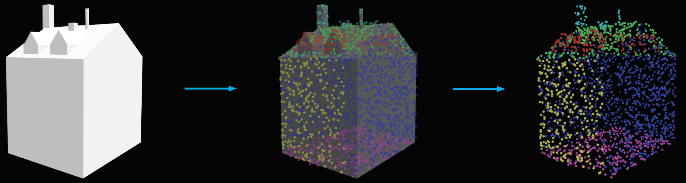
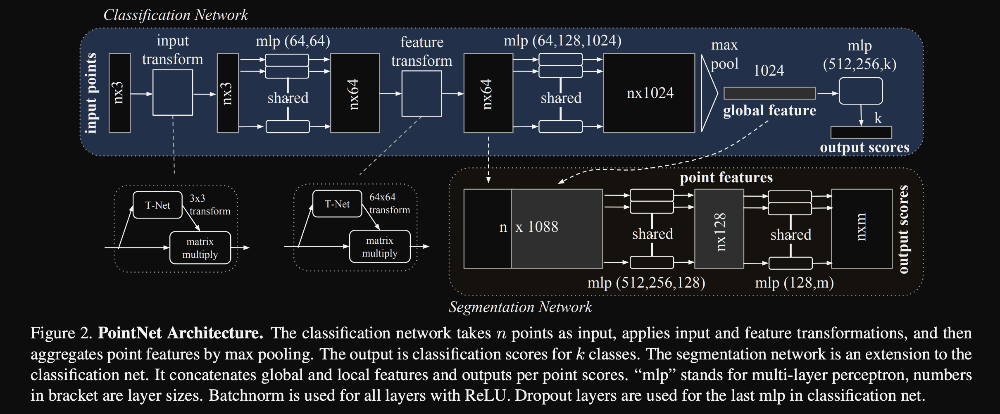
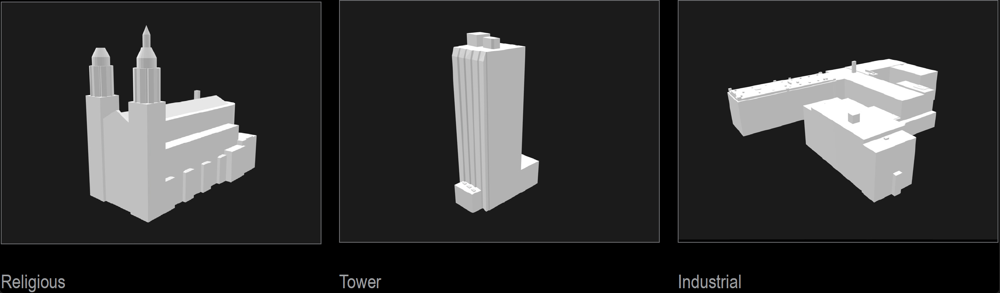
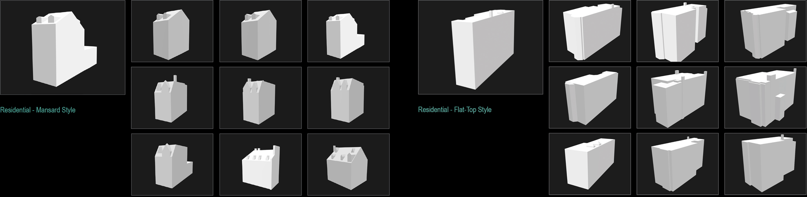
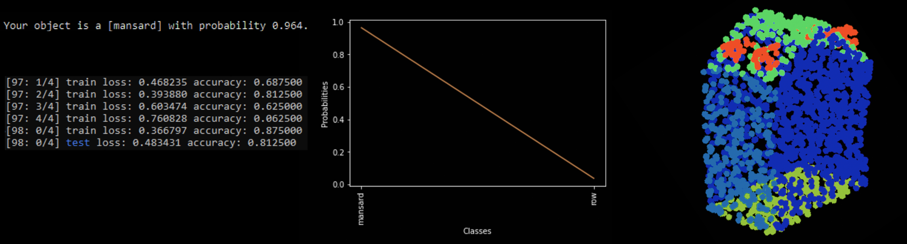
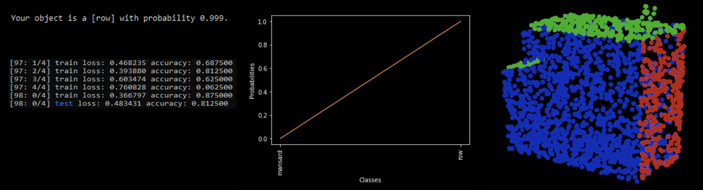
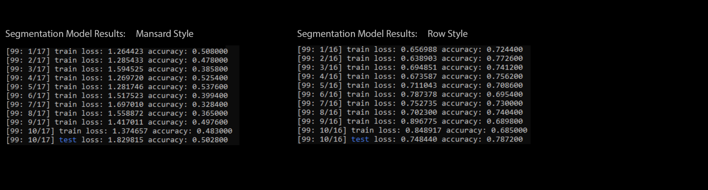

# 3D Building Classification & Segmentation Pipeline

## Overview

### Intro
This project provides a robust pipeline for the autonomous classification and segmentation of individual buildings extracted from large 3d urban models through the seamless combination of parametric modelling tools (Grasshopper), dataset preprocessing scripts, and DNN algorithms (PointNet). 

### Background: 
Autonomous classification and segmentation of 3d objects using Deep Neural Networks (DNN) has become an extremely useful and effective technique leveraged within many fields including but not limited to the autonomous vehicle industry for roadway navigation, the robotics field for object interaction, and the medical field for 3d image analysis.  Though its accuracy, speed and clear benefits are well known, DNN based 3D object segmentation & classification methods have yet to be widely adopted within the Architecture, Engineering, & Construction (AEC) idustry.  However, as interest in AI continues to grow within the AEC industry as indicated by increased investment and research in things like Con-Tech tools such real-time construction site tracking, autonomous robotic navigation of architectural environments, and DNN-based architectural generation & analysis methods, the ability to rapidly classify and segment buildings into their parts and pieces becomes increasingly important.



## Pipeline Description

The pipeline presented here can be broken down into 4 main stages; the building extraction stage, the dataset pre-processing and creation stage, the model training stage, and the visualizing results stage.  

1. Within the first stage, large 3d urban models are broken down into thousands of individual buildings which can then be extracted and exported one-by-one as closed .obj files. In this experiment, the city of Montreal 3d city model was used and approx. 50,000 buildings were exported as individual .obj files. After further pre-processing, a portion of these 3d buildings (as chosen by the user) will be used as the training data to train the DNN PointNet model in step 3.

2. Within the second stage, individual .obj building files chosen for training are pre-processed to match the input-data requirements of the PointNet model.  Requirements include size normalization, conversion into a 2048 point point-cloud, and pre-segmentation.  After these requirements are achieved via custom scripts, individual building models are then split into two file formats: a .pts model which is a list of coordinates (x,y,z) of all of its 2048 points, and a .seg file which contains the segementation category that corresponds to each individual point (ex. the segmentation category "1" representing "roof" which corresponds to the first point).  These two files represent the final data format to be used to train the model. In addition, train-test-validate JSON files are created via a custom script in order to break up the dataset into its corresponding categories as well as various .txt files required for training.  After completion of the previously mentioned steps, the training dataset is ready to be used.

3. Within the third stage, two PyTorch-based PointNet models are trained on the previously created dataset; one for 3d object classification and one for 3d object part-segmentation.  After training, these models can then be used to predict the class and part segmentation category for new unseen 3d building data.

4. Within the final stage, we use our models to make both classification and segmentation predictions and visualize our results using: 1) [fxia22's PointNet Implimentation repo](https://github.com/fxia22/pointnet.pytorch) for segmentation predictions, and 2) [yxlao's Open3D PointNet Jupyter Notebook](https://github.com/isl-org/Open3D-PointNet) for classification visualizations.

## Dataset

- 50 "mansard style" houses represented as .pts & .seg files
- 50 "row-house style" buildings represented as .pts & .seg files
- Dataset available for download [here](https://drive.google.com/drive/folders/1SXFraG805kFRI_Fwp4wanDwHjQg5roaj?usp=sharing).  After download, move folder into "data" folder in repo.

## Model: PointNet
PointNet is "a deep neural network that directly consumes point clouds, which well respects the permutation invariance of points in the input [and] provides a unified architecture for applications ranging from object classification & part segmentation."

The classification & segmentation PointNet models we used are implimented in PyTorch and are based on the [original PointNet paper](https://arxiv.org/abs/1612.00593) and sourced from [fxia22's PointNet Implimentation repo](https://github.com/fxia22/pointnet.pytorch) with slight modifications made to accomodate our custom building data. 


PointNet architecture (sourced from original [PointNet Paper](https://arxiv.org/abs/1612.00593))

## Usage

The following is a descriptive set of instructions to duplicate the work carried out in this repo.

### Stage 1: Building Extraction

#### 1. Download 3D Urban Model (.3dm)

Many cities and regions provide open-source 3d urban models available online and for download.  In this experiment, we used the 2016 [LOD2 Montreal City 3D Model](https://donnees.montreal.ca/ville-de-montreal/batiment-3d-2016-maquette-citygml-lod2-avec-textures2) in [.3dm format](https://fileinfo.com/extension/3dm) as shown below. The Montreal urban model is broken down into 65 tiles containing approx. 50,000 individual buildings total. Though other file formats can be used, our custom grasshopper tool in stage 1 was specifically designed to convert .3dm files into .obj file format.  However, many city models are already availble in .obj format, thus potentially simplifying the building-extraction method.  Some urban models already in .obj format include [Berlin](https://www.businesslocationcenter.de/en/economic-atlas/download-portal/), [Amsterdam](https://3d.bk.tudelft.nl/opendata/3dfier/), and [Helsinki](https://hri.fi/data/en_GB/dataset/helsingin-3d-kaupunkimalli).


Coverage map showing extent of montreal urban model (left) and example of a single urban tile representing the city downtown core (right).

#### 2. Extract Individual Buildings

A custom parametric [grasshopper](https://www.rhino3d.com/6/new/grasshopper/) script was developed within the 3d modeling software [Rhino3d](https://www.rhino3d.com/) in order to automatically load each of the 65 .3dm city tiles, extract and close each building mesh seperately, and export as an .obj file on a per-building basis.  In order to ensure clean extractions and consistency, non-building artefacts, incomplete buildings, and buildings that contained multiple masses were automatically discarded.



An example of the grasshopper script quickly extracting and exporting individual buildings from the original .3md Montreal 3d data tile.

### Stage 2: Dataset Pre-Processing & Creation

#### 1. Select Buildings to Use as Training Dataset

As shown below, 2 building groups; "flat-top style" and "mansard style" rowhouses were manually collected to create datasets to train both the classification and segmentation PointNet models.  As PointNet is able to learn the patterns inherent in collections of similar styled 3d objects, it is important to ensure that similar style buildings are collected and organinzed into their associated style-based categories in order to ensure effective results. Though this manual process seems difficult, as few as 50 buildings per category can be used to adequately train the model.

* In future work, unsupervized models will be used to automatically cluster buildings into their respective stylist categories, thus, speeding up the dataset creation process and removing any bias and innacuracies within the training data selection process.



#### 2. Convert .obj Files to .off Format

To begin the pre-processing stage, all .obj files must be converted into [.off file format](https://shape.cs.princeton.edu/benchmark/documentation/off_format.html) in order to be read by the normalization and cloud conversionscript in the next step. .off files represent goemetry by specifying the polygons of the model's surface.
```
python "scripts/obj_to_off.py"
```
#### 3. Convert .off Files to Point Clouds, Normalize, and Export as .ply Files

As PointNet requires point cloud data as input, the .off files must be first converted into a collection of points.  This is done by calculating the [barycentric coordinates](https://mathworld.wolfram.com/BarycentricCoordinates.html) of the polygon surface that make up the .off geometry. When complete, 2048 of these x,y,z coordinates are randomly chosen to represent the object. Once converted, a normalize point cloud function via unit sphere converts all of the points into a range between -1 & 1 in order to standardize the final point cloud size.  Finally, the normalized pointclouds are exported into [.ply format](http://paulbourke.net/dataformats/ply/) in order to be easily segmented within Rhino and further converted into the proper file formats in the next steps. This step is based on an [online tutorial](https://towardsdatascience.com/deep-learning-on-point-clouds-implementing-pointnet-in-google-colab-1fd65cd3a263) and is represented from lines 1 through 150 of our script "off_to_ply.py".

```
python "scripts/off_to_ply.py"
```


#### 4. Manually Pre-Segment .ply Building Geometry and Resave

Each .ply building geometry file must be pre-segmented in order to be used for model training and testing.  For the project, Rhino3D was used to colorize all points according to building component.  In this case, 7 building component categories were used to segment the models.  Categories include: "ground floor", "walls", "extension", "roof", "windows", "chimney" and "front facade".  


#### 5. Create .pts and .seg files

Next, the newly created .ply files are then split into two file formats: a .pts file which is a list of coordinates (x,y,z) of all of its 2048 points, and a .seg file which contains the segementation category that corresponds to each individual point (ex. the segmentation category "1" representing "roof" which corresponds to the first point).  These .pts and .seg files will be used as the final dataset to be input into both the classification and segmentation PointNet model.
```
python "scripts/pts_seg_files.py"
```
#### 6. Create train/test split JSON files
This step splits the dataset into 3 groups; training data (70%), testing data (20%), and validation data (10%).
```
python "scripts/json_list.py"
```

#### 7. Update Text Files

The following text files required manual updating.

- pointnet/misc/modelnet_id.txt (update building index id)
- pointnet/misc/num_seg_classes.txt (update number of segmentation groups per building category)
- pointnet/montreal_data/synsetoffset2category.txt (update building category id)

### Stage 3: Model Training

We can then use our custom building dataset to train both the classification and segmentation PointNet models.

#### 1. Train Classification Model
```
cd pointnet
python train_classification.py --nepoch=100 --batchSize=8
```

#### 2. Train Segmentation Model
```
cd pointnet
python train_segmentation.py --dataset "montreal_rowhouse_data" --nepoch=100 --batchSize=8
```

### Stage 4: Visualizing Results

#### 1. Visualizing Classification Results
Ensure that the latest saved model path file (.pth) is saved into the "visualize/class" folder.
```
cd visualizations/class
jupyter notebook
# follow instructions in notebook to visualize results
```

#### 2. Visualizing Segmentation Results
```
cd visualizations/seg
python show_seg.py
# only works in ubuntu
```

## Results

### Classification Model Performance

For this experiment, our Pointnet classification model was trained on 100 different buildings (50 "mansard" style & 50 flat-roof "row house" style) for 100 epochs with a batch size of 16.  After training we achieved a classification accuracy of approx. 81.25% and loss of approx. 0.4834. Prediction examples are shown below as well as the training and test accuracy and loss results for the final training epoch.




### Segmentation Model Performance

For this experiment, our Pointnet segmentation model was trained on 100 different pre-segmented buildings (50 "mansard" style & 50 flat-roof "row house" style buildings) for 100 epochs with a batch size of 4.  For the "row house" style building, model accuracy peaked at approx. 78.72% with a loss of 0.7484.  This fairly high accuracy was likely due to the reduced number of segmented parts (3 - roof, facade, and remaining walls / floor) which were fairly consistent in shape across models. 

For the "mansard" style buildings, model accuracy peaked at approx. 50.2% with a loss of 1.829.  Though seemingly mediocre, the Mansard style buildings are broken down into 7 segemented parts (chimnney, floor, windows, roof, extensions, front facade, and walls), thus getting 50% correct is somewhat impressive given the total number of potential mistakes possible.  

Future research will attempt to increase accuracy through increasing the dataset set size via augmentation and using more than points than the current count of 2048 in order to capture higher levels of detail and ensure that segmented parts are clearly defined.


